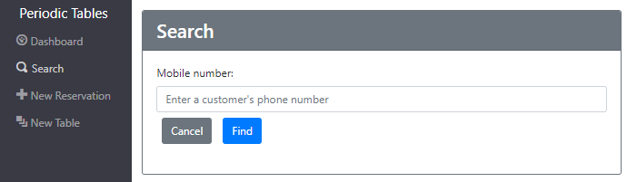

# **Periodic Tables**- Restaurant Reservation System

---
## Links
* [Live Demo](https://front-end-ten-umber.vercel.app/)

---
## Summary
This application is a reservation system created for the fine dining restaurant, Periodic Tables. The software is used by restaurant personnel when a customer calls to request a reservation. The application allows the user to list reservations by date, search for reservations by mobile number, create new and update existing reservations. The application also allows the user the ability to create and manage restaurant tables.

---
## API:

| Path | Request | Description |
| ---------------- | ----- | ---------------------------------------------------------------- |
| `/reservations` | POST | create a new reservation |
| `/reservations` | GET | list all reservations, sorted by time |
| `/reservations/:reservation_id` | GET | read a reservation by reservation_id |
| `/reservations/:reservation_id` | PUT | update an existing reservation by reservation_id |
| `/reservations?date=YYYY-MM-DD` | GET | list all reservations for the date specified |
| `/reservations?mobile_number=XXX-XXX-XXXX` | GET | list all reservations for the mobile_number specified, will accept a partial mobile_number |
| `/reservations/:reservationId/status` | PUT | update the status of an existing reservation by reservation_id  |
| `/tables` | GET | list all tables |
| `/tables` | POST | create a new table |
| `/tables/:table_id/seat` | PUT | seat a reservation at a table |
| `/tables/:table_id/seat` | DELETE | finish an occupied table |

---
## Screenshots:

### Dashboard
 > The **Dashboard** displays the a list of the reservations for a particular date. Each booked reservation contains buttons to `Seat`, `Edit`, or `Cancel` the reservation.
>
 > The navigation buttons: `Previous`, `Today`, and `Next` allow the user to change the date displayed on the dashboard.
>
 > A List of tables is also displayed to show which tables are currently available. A `Finish` button is displayed when a table is currently 'occupied'. Selecting the `Finish` button will set the table status to 'free', and update the Dashboard.

### New Reservation
 > The **Create Reservation** page allows the user to create a new reservation. The reservation must be made in the future, and only during the hours the restaurant is open, up to 60 minutes before closing. 

### Edit Reservation
 > The **Edit Reservation** page allows the user to modify or cancel an existing reservation.

 

### Seat Reservation
> The **Seat Reservation** page allows the user to assign a reservation to a specific table.

### New Table
> The **New Table** page allows the user to create a new table, and assign a table name and seating capacity to the table.

### Search
> The **Search** page allows the user to search for a reservation by a partial or complete mobile phone number.

---
## Technology used:

 *A full-stack app built with:* 

- **Client:** React.js, JavaScript, HTML, Bootstrap, RESTful API
Server: Node, Express, Knex

- **Database:** Postgres SQL

- **Tools:** GitHub, Vercel

---
## Installation:

1. Fork and clone this repository.
1. Run `cp ./back-end/.env.sample ./back-end/.env`.
1. Update the `./back-end/.env` file with the connection URL's to your ElephantSQL database instance.
1. Run `cp ./front-end/.env.sample ./front-end/.env`.
1. You should not need to make changes to the `./front-end/.env` file unless you want to connect to a backend at a location other than `http://localhost:5000`.
1. Run `npm install` to install project dependencies.
1. Run `npm run start:dev` to start your server in development mode.